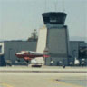

# Flight Simulator Replayer

## Overview

A legacy project used to "replay" actual flights in Microsoft Flight Simulator 2002,
recorded in one of the popular GPS track log formats, such as:

- [GPS eXchange Format (*.gpx)](https://en.wikipedia.org/wiki/GPS_Exchange_Format)
- [NMEA Stream (*.nmea)](https://en.wikipedia.org/wiki/NMEA_0183)

As of this update, an effort to revive this project to support Microsoft
Flight Simulator 2020, and development under Visual Studio 2019, is underway.

## Example Flights

Sample track logs were produced by the following applications:

- PalmOS GPS App Log (*.pdb)
- Pathaway NMEA Log (*.pnl)
- Cetus Track Log (*.ctl)

See examples of each type of track log from actual flights in 
the [sample track logs](samples/tracklogs) folder.

Many of the samples were recorded using these hardware devices:

- Magellan GPS Companion Springboard Module for Handspring Visor
- Garmin nuvi

## Building & Development

An updated top-level build file is at [build/fsr.sln](build/fsr.sln), which
successfully loads into Microsoft Visual Studio 2019 for building and 
continued development.

### Note: Old Source Files

The project files were copied from (what is believed to be) the most recent
backup CD, marked on the front with the date "July 20, 2004", i.e.:

- `040720-restore/FSR/Data`
- `040720-restore/FSR/Rev2/GpsVideo`

The source files were then re-organized to better conform to updated best practices.
See an older version of this file for more historical details.
